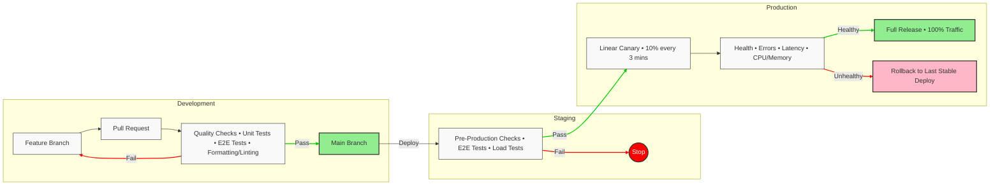

# Autopilot Interview

Welcome to Autopilot's interview! This repository is a production-grade
environment that mirrors our internal development stack, designed to give you a
real taste of what it's like to work with us.

## Our Interview Process

At Autopilot, we believe the best way to evaluate talent is through real-world
scenarios. This repository provides you with a complete development environment
that closely resembles our production stack, allowing you to:

- Experience our modern, full-stack development workflow
- Work with the same tools and technologies we use daily
- Demonstrate your problem-solving skills in a realistic setting

### How To Apply

1. Read the repository, familiarize yourself with the project.
2. Ensure that you know how the flow works from frontend to backend.
3. Once you are comfortable/productive working with our tech stack, please
proceed to apply for [Product Engineer](https://app.dover.com/apply/Autopilot/313a9962-2230-48bd-b22d-6abc119f1ea6).
4. We will get back to you within 72 hours to schedule an interview if your
profile matches our requirements.

### What To Expect

During this 90-minute technical interview, we'll cover the following phases:

- Self-Introduction (5 minutes)
- Requirements Clarification & Discussion (10 minutes)
- Database Schema Implementation (15 minutes)
- API Development & Integration Testing (50 minutes)
- Closing Discussion (10 minutes)

> [!NOTE]
> It's important to understand how API key authentication is done and how to
> retrieve entity ID from it.

### Evaluation & Requirements
Please ensure you have a reliable development environment set up and are
comfortable working within the allocated timeframes. **Effective time management across each phase**
is a key component of this assessment. We'll be evaluating your performance
across the following areas:

#### Problem-solving approach
How you break down requirements and tackle complex challenges.

#### Code quality and architecture decisions
Clean, maintainable code with sound design principles.

#### Testing strategies
Effective use of mocks, stubs, spies, and comprehensive test coverage.

#### Communication skills
Clear articulation of your thought process and technical decisions.

#### Adaptability with new technologies
Ability to learn and work effectively with unfamiliar tools or frameworks.

## Project Structure

```
├── apps/                      # Frontend applications
│   └── dashboard/             # Main dashboard app
├── backends/                  # Backend services
│   ├── api/                   # API Gateway & Modular Monolith
│   │   ├── internal/          # Internal modules
│   │   │   ├── identity/      # Identity & Authentication module
│   │   │   │   ├── handler/   # HTTP handlers
│   │   │   │   │   └── v1/    # v1 API endpoints
│   │   │   │   │       ├── apikey.go        # API key management
│   │   │   │   │       ├── connection.go    # OAuth connections
│   │   │   │   │       ├── provider.go      # Auth providers
│   │   │   │   │       ├── session.go       # Session management
│   │   │   │   │       ├── twofactor.go     # 2FA implementation
│   │   │   │   │       ├── user.go          # User management
│   │   │   │   │       └── v1.go            # v1 API endpoints
│   │   │   │   ├── model/    # Domain models
│   │   │   │   ├── service/  # Business logic
│   │   │   │   ├── store/    # Data persistence
│   │   │   │   ├── auth.go   # Core auth logic
│   │   │   │   └── module.go # Module config
│   │   │   │
│   │   │   └── payment/      # Payment processing module
│   │   │       ├── ...
│   │   │       └── module.go # Module config
│   │   │
│   │   ├── pkg/              # Public packages
│   │   │   ├── app/          # Application core
│   │   │   │   ├── mocks/    # Mock implementations
│   │   │   │   ├── config.go     # Config management
│   │   │   │   ├── container.go  # DI container
│   │   │   │   └── turnstile.go  # Turnstile security
│   │   │   ├── httpx/        # HTTP utilities
│   │   │   ├── middleware/   # HTTP middleware
│   │   │   └── testutil/     # Testing utilities
│   │   │
│   │   ├── seeders/          # Database seeders
│   │   ├── migrations/       # Database migrations
│   │   ├── templates/        # Email templates
│   │   ├── locales/          # i18n translations
│   │   ├── main.go           # Entry point
│   │   ├── debug.go          # Debug config
│   │   └── release.go        # Release config
│   │
│   └── internal/             # Shared backend packages
│       ├── cmd/              # CLI commands
│       ├── core/             # Core services (DB, HTTP, etc)
│       ├── grpc/             # gRPC utilities
│       ├── http/             # HTTP utilities
│       ├── pb/               # Protocol Buffer definitions
│       ├── pbgen/            # Generated gRPC code
│       └── types/            # Shared types
└── packages/                 # Shared packages
    ├── api/                  # API client library
    ├── ui/                   # UI component library
    └── typescript-config/    # Shared TS configs
```

## Quick Start

## Prerequisites

- Linux:
   - Install Docker and Docker Compose
- MacOS:
   - Install [OrbStack](https://orbstack.dev/download)

## Setup

```sh
# Install `mise`
$ curl https://mise.run | sh

# Add this to your shell profile if `mise` is not in your PATH
$ export PATH="$HOME/.local/bin:$PATH"

# Activate `mise` in your .profile
# Activation options: https://mise.jdx.dev/installing-mise.html#shells
#
# Run ONE of these:
$ echo 'eval "$(mise activate bash)"' >> ~/.bashrc
$ echo 'eval "$(mise activate zsh)"' >> "${ZDOTDIR-$HOME}/.zshrc"
$ echo 'mise activate fish | source' >> ~/.config/fish/config.fish

# Open and validate `mise.toml` before trusting (inside repository root)
$ mise trust

# Install the toolings
$ mise install

# Install projects' dependencies
$ mise setup

# Setup docker services (databases, migrations)
$ mise reset

# Start Development servers (auto restart)
$ mise dev

# Run API binary's subcommands (e.g. generate migration files, run pending migrations, etc.)
$ mise api --help

# To run db migration
$ mise api gen:migration --db postgres://postgres:postgres@db:5432/identity
```

### **Development**

 The `mise dev` command will start all necessary services. After starting,
 run the command in another terminal to view the local development URLs:
 ```sh
 $ mise domains
 ```

### Testing the Frontend

To verify that everything is working, you can try to access the dashboard. There
isn't much there - but you can use it to verify everything is working right.

- URL: https://localhost:3000/ (Try refreshing to give React a time to start up fully)
- Username: `admin@acme.com`
- Password: `Strongpa$$w0rd!`

 All services feature hot reload capabilities, automatically rebuilding and
 refreshing when code changes are detected:
 - API contract changes in `packages/api/src/contracts`
 - OpenAPI spec updates from backend API handlers

## Architecture

Our system follows a modular monolith architecture with clean, layered patterns
in each module. The modular design allows for clear boundaries between business
domains while maintaining the simplicity and reliability of a monolithic deployment.
Here's how requests flow through our system:

```mermaid
graph TB
    subgraph "Frontend Apps"
        direction TB
        dashboard["Dashboard App"]-->|"HTTP/REST"|api_client["API Client Library"]
        checkout["Checkout Portal"]-->|"HTTP/REST"|api_client
    end

    subgraph "Modular Monolith"
        direction TB
        subgraph "Infrastructure Layer"
            config["Configuration"]-->|"Env Vars"|modules
            di["DI Container"]-->|"Dependencies"|modules
            middleware["Middleware"]-->|"HTTP Pipeline"|modules
        end

        subgraph "Modules"
            direction TB
            api_client-->|"HTTP/REST"|modules["HTTP Router"]

            subgraph "Identity Module"
                direction TB
                modules-->|"Route"|identity_h["Identity Handlers"]
                identity_h-->|"Domain Models"|identity_s["Identity Services"]
                identity_s-->|"Data Ops"|identity_store["Identity Store"]
                identity_store-->|"Read/Write"|identity_db[("Identity DB")]
                identity_store-->|"Cache"|identity_cache["Identity Cache"]
                identity_store-->|"Files"|identity_s3["Identity Storage"]
            end

            subgraph "Payment Module"
                direction TB
                modules-->|"Route"|payment_h["Payment Handlers"]
                payment_h-->|"Domain Models"|payment_s["Payment Services"]
                payment_s-->|"Data Ops"|payment_store["Payment Store"]
                payment_store-->|"Read/Write"|payment_db[("Payment DB")]
                payment_store-->|"Cache"|payment_cache["Payment Cache"]
                payment_store-->|"Files"|payment_s3["Payment Storage"]
                payment_s-->|"Integration"|payment_proc["Payment Processors"]
                payment_proc-->|"External"|adyen["Adyen"]
                payment_proc-->|"External"|stripe["Stripe"]
            end

            subgraph "Payout Module"
                direction TB
                modules-->|"Route"|payout_h["Payout Handlers"]
                payout_h-->|"Domain Models"|payout_s["Payout Services"]
                payout_s-->|"Data Ops"|payout_store["Payout Store"]
                payout_store-->|"Read/Write"|payout_db[("Payout DB")]
                payout_store-->|"Cache"|payout_cache["Payout Cache"]
                payout_store-->|"Files"|payout_s3["Payout Storage"]
                payout_s-->|"Methods"|payout_methods["Payout Methods"]
                payout_s-->|"Integration"|payout_proc["Payout Processors"]
                payout_proc-->|"External"|fiatpe["FiatPE"]
                payout_proc-->|"External"|xflow["XpressFlow"]
            end
        end

        subgraph "Shared Infrastructure"
            direction TB
            monitoring["Monitoring"]
            logging["Logging"]
            metrics["Metrics"]
            tracing["Tracing"]
        end
    end

    classDef frontend fill:#f9f9f9,stroke:#333,stroke-width:2px
    classDef module fill:#dae8fc,stroke:#333,stroke-width:2px
    classDef infra fill:#e1f3d8,stroke:#333,stroke-width:2px
    classDef store fill:#ffe6cc,stroke:#333,stroke-width:2px
    classDef external fill:#f8cecc,stroke:#333,stroke-width:2px
    classDef data fill:#d5e8d4,stroke:#333,stroke-width:2px
    class dashboard,checkout frontend
    class identity_h,identity_s,payment_h,payment_s,payout_h,payout_s module
    class config,di,middleware,modules,monitoring,logging,metrics,tracing infra
    class identity_store,payment_store,payout_store store
    class identity_db,payment_db,payout_db,identity_cache,payment_cache,payout_cache,identity_s3,payment_s3,payout_s3 data
    class adyen,stripe,fiatpe,xflow external
```



## CI/CD Workflow

We follow a robust CI/CD pipeline that ensures code quality and reliable deployments. Our CI pipeline (defined in `.github/workflows/ci.yml`) automatically enforces the following quality gates on every pull request:

- **Formatter/Linter Checks**: Ensures consistent code style and catches common issues
- **Security Checks**: Runs security audits on both frontend and backend dependencies
- **Unit Tests**: Validates core functionality across all services
- **UI Tests**: Ensures visual consistency and catches UI regressions

No code can be merged to the main branch unless all these checks pass, maintaining our high quality standards.



Our deployment pipeline ensures code quality and reliability through:

1. **Development**
   - Feature branches for isolated development
   - Pull requests with automated quality checks
   - Comprehensive testing suite (unit, E2E)
   - Code formatting and linting enforcement

2. **Staging**
   - Pre-production validation
   - End-to-end testing in staging environment
   - Load testing to ensure performance

3. **Production**
   - Linear canary deployments (10% traffic increments)
   - Continuous health monitoring
   - Automated rollback capabilities
   - Full release after successful validation

## Need Help?

If you have any questions about the setup or requirements, don't hesitate to
ask. We're here to ensure you can focus on showcasing your skills rather than
fighting with setup issues.
